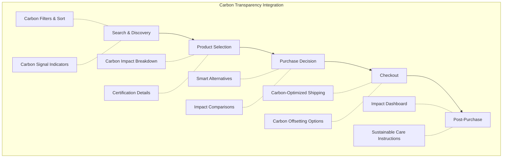
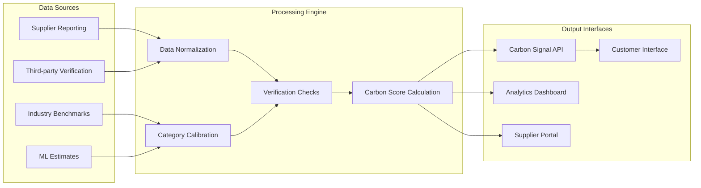
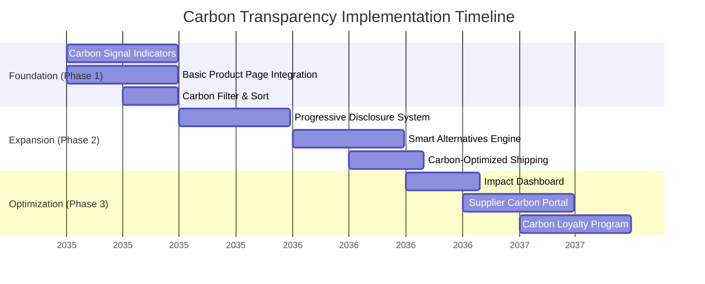
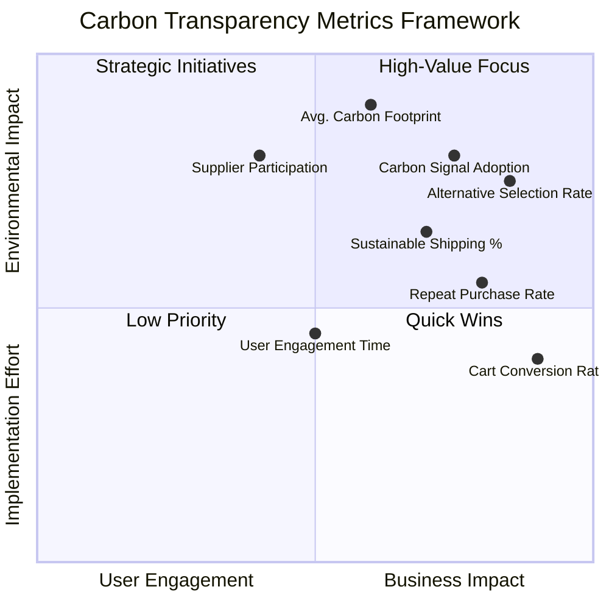
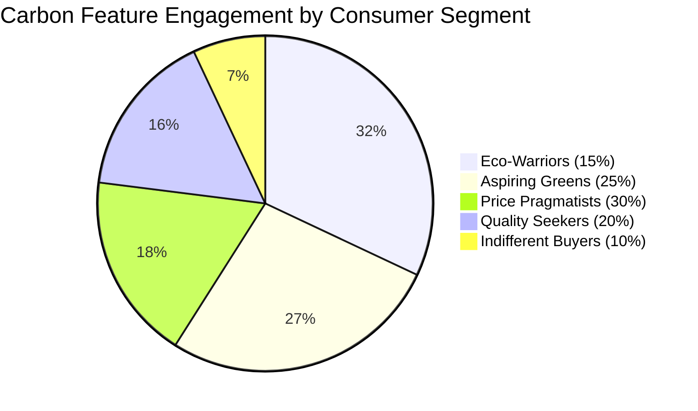
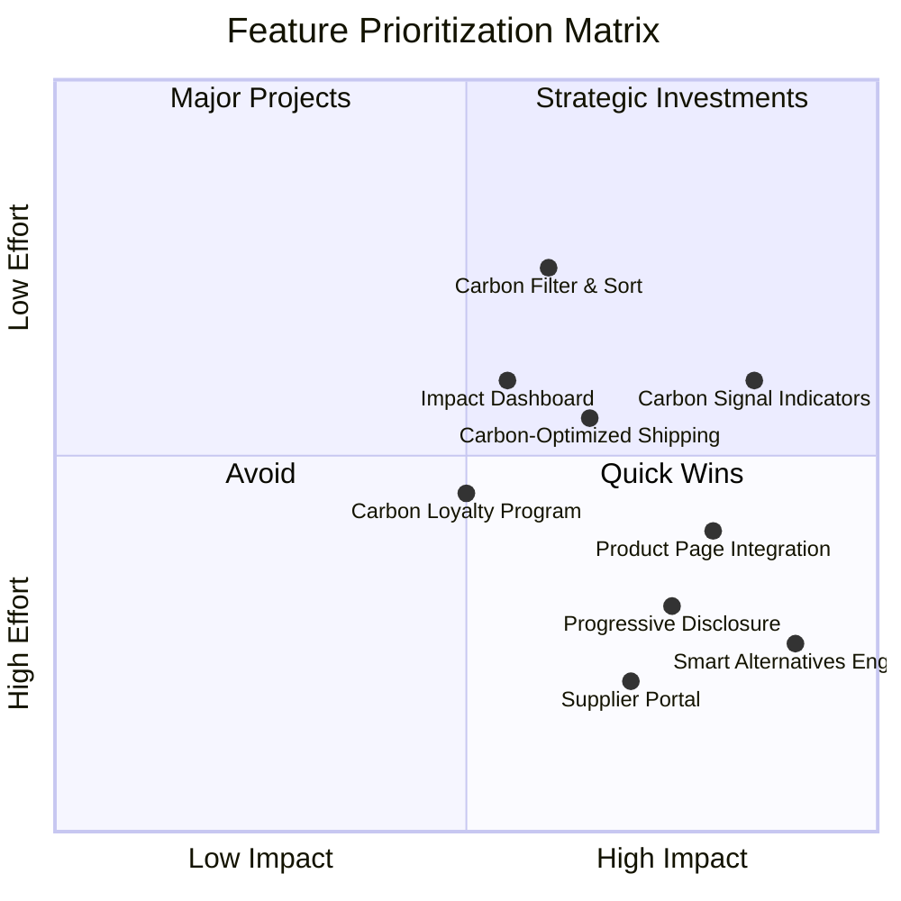

# Carbon Transparency Imaginary Implementation Framework

## Overview: The Carbon-Conscious Shopping Journey



## Progressive Disclosure Framework

```mermaid
journey
    title Carbon Information Disclosure Levels
    section Level 1: At a Glance
        Visible to all users: 5: Carbon Signal Rating
        Product listings & search results: 5: Simple visual indicators
        Minimal cognitive load: 5: Color-coded system
    section Level 2: One Touch Away
        Available with single interaction: 4: Category comparison
        Context-specific information: 4: Key carbon attributes
        Quick decision support: 5: Alternative suggestions
    section Level 3: Deep Dive
        For engaged users: 3: Comprehensive breakdown
        Data transparency: 3: Methodology explanation
        Expert information: 3: Certification details
```

## Data Collection and Processing Pipeline



## Implementation Roadmap



## Key Performance Metrics Framework



## Consumer Segment Strategy



## Feature Priority Matrix


