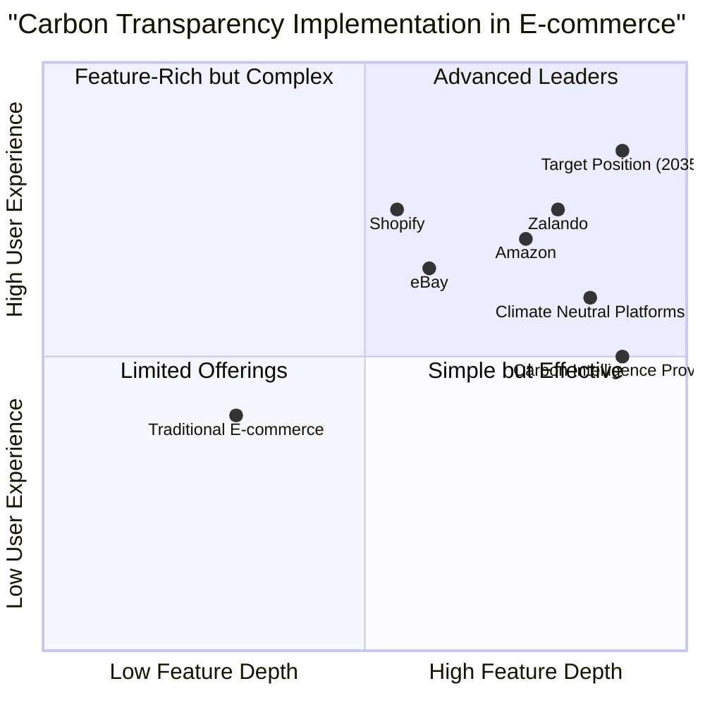

# Carbon Transparency in E-Commerce: Market Research Report

## 1. Executive Summary

This report examines the emerging landscape of carbon transparency in e-commerce, focusing on trends, regulations, consumer behavior, and implementation strategies that will shape the industry by 2035. With sustainability becoming a critical business imperative and regulatory requirement, e-commerce platforms must integrate carbon footprint data throughout the customer journey while maintaining seamless user experiences. This report provides the foundation for developing an effective product strategy to address these challenges.

## 2. Industry Overview

### 2.1 Market Size and Growth

The product carbon footprint verification market is experiencing substantial growth:
- Market size increased from $12.12 billion in 2024 to $14.72 billion in 2025 (21.4% CAGR)
- Projected to reach $31.62 billion by 2029 (21.1% CAGR)

This growth is driven by increasing regulatory pressure, consumer demand for sustainable products, and corporate sustainability commitments.

### 2.2 Regulatory Landscape

By 2035, regulatory frameworks around sustainability reporting and carbon footprint transparency are expected to be significantly more stringent:

- **Global Mandatory Carbon Disclosure**: Building on frameworks like the EU Corporate Sustainability Reporting Directive (CSRD) and SEC climate-related disclosures, by 2035 most major economies will require standardized carbon reporting for products and services.
  
- **Product-Level Carbon Labeling Requirements**: Regulations will likely mandate standardized carbon footprint information on products, similar to nutritional labels on food products today.

- **Carbon Border Adjustment Mechanisms**: These will impose carbon taxes on imported goods based on their carbon footprint, making transparency essential for cross-border e-commerce.

### 2.3 Industry Trends

1. **End of Greenwashing**: Stricter disclosure requirements have made unsubstantiated sustainability claims legally risky for businesses.

2. **Supply Chain Transparency**: Complete visibility into the carbon impact of every stage of the supply chain is becoming standard practice.

3. **AI-Powered Carbon Measurement**: Advanced AI systems can now calculate real-time, accurate carbon footprints for complex products across global supply chains.

4. **Carbon as a Currency**: Some platforms have introduced carbon credit systems where consumers can earn rewards for making low-carbon purchasing decisions.

5. **Circular E-commerce**: Integration of reuse, recycling, and take-back programs directly into the e-commerce experience to reduce overall emissions.

## 3. Consumer Behavior Analysis

### 3.1 Consumer Attitudes Toward Carbon Transparency

Recent studies indicate strong and growing consumer interest in sustainable shopping:

- 78% of US consumers consider sustainable lifestyle important
- Nearly 70% of global consumers are willing to pay more for sustainable products
- 73% of consumers would change their habits to reduce environmental impact

However, behavioral economics research reveals a persistent "intention-action gap" where stated sustainability preferences don't always translate to purchasing decisions:

- Only 10-15% of consumers consistently make purchase decisions based primarily on sustainability factors
- Price, convenience, and brand loyalty often outweigh environmental considerations in the moment of purchase
- Information overload can lead to decision paralysis and abandonment

### 3.2 Effectiveness of Carbon Labels

Research on carbon labeling shows mixed but promising results:

- Product-level sustainability scores can significantly impact buying behavior, with effectiveness comparable to traditional customer rating systems (1-5 stars)
- Simple, visually appealing labels integrated into existing product information are more effective than complex, technical presentations
- Labels backed by reputable third-party certifiers are perceived as more trustworthy
- Comparative labels (showing relative performance against similar products) drive more behavior change than absolute values

### 3.3 Psychological Factors Influencing Carbon Transparency Usage

Several psychological principles impact how consumers interact with carbon information:

- **Status Quo Bias**: Consumers tend to stick with familiar options unless given compelling reasons to change
- **Choice Architecture**: The way options are presented significantly impacts decision-making
- **Social Proof**: Showing how other consumers make sustainable choices increases adoption
- **Loss Aversion**: Framing environmental impact as avoiding losses rather than achieving gains is more effective
- **Present Bias**: Immediate benefits (like discounts) are more motivating than long-term environmental benefits

### 3.4 Consumer Segments and Their Response to Carbon Information

Consumers can be categorized into distinct segments based on their response to sustainability information:

1. **Eco-Warriors (15%)**: Actively seek out carbon information and prioritize it in purchase decisions
2. **Aspiring Greens (25%)**: Care about sustainability but need convenient ways to act on their values
3. **Price Pragmatists (30%)**: Consider environmental factors only when cost-neutral or beneficial
4. **Quality Seekers (20%)**: Focus on product performance but may associate sustainability with quality
5. **Indifferent Buyers (10%)**: Pay little attention to sustainability information

## 4. Implementation Strategies and Best Practices

### 4.1 Carbon Footprint Measurement Methodologies

Measuring product carbon footprints in e-commerce requires several complementary approaches:

- **Product Carbon Footprint (PCF) Measurement**: Calculating greenhouse gas emissions across the product lifecycle
  - **Cradle-to-gate**: From raw material extraction through production
  - **Cradle-to-grave**: Entire lifecycle including consumer use and disposal

- **Key Methodologies**:
  - **Spend-based Method**: Quick but less accurate, based on financial value of purchased goods/services
  - **Activity-based Method**: More accurate but data-intensive, based on actual supply chain activities
  - **Hybrid Method**: Combines both approaches for optimal balance of accuracy and feasibility

- **Carbon Impact Distribution in E-commerce**:
  - Packaging (45%)
  - Returns (25%)
  - Property-level emissions (15%)
  - Transportation (13%)
  - Logistics operations (2%)

### 4.2 Display Strategies for Carbon Information

Effective approaches to displaying carbon information in the e-commerce journey include:

1. **Product Listing Pages**:
   - Simple visual indicators (color-coded scales, leaf icons)
   - Filtering and sorting options based on carbon footprint
   - Comparative metrics within product categories

2. **Product Detail Pages**:
   - Detailed breakdown of carbon footprint sources
   - Interactive elements showing impact of different options (size, color, material)
   - Contextual information ("equivalent to X miles driven")

3. **Shopping Cart and Checkout**:
   - Total carbon footprint of the entire order
   - Alternative shipping options with carbon impact comparison
   - Carbon offset opportunities

4. **Post-Purchase**:
   - Order confirmation with carbon savings achieved
   - Product care instructions to minimize use-phase emissions
   - Disposal and recycling guidance

### 4.3 UI/UX Best Practices for Carbon Transparency

1. **Progressive Disclosure**: Layer information to avoid overwhelming users
   - Level 1: Simple indicators visible to all users
   - Level 2: More detailed information available on demand
   - Level 3: Comprehensive data for highly engaged users

2. **Visual Design Principles**:
   - Use consistent visual language across the platform
   - Integrate carbon indicators into existing UI elements
   - Maintain visual hierarchy to prioritize primary shopping functions

3. **Sustainable UI Implementation**:
   - Optimize image and media assets
   - Streamline page design for performance
   - Consider energy-efficient color schemes
   - Use system fonts and optimize typography

## 5. Competitive Analysis

### 5.1 Current Leaders in Carbon Transparency

#### Amazon
- Implemented comprehensive tracking of delivery emissions
- Displays carbon impact of different delivery options at checkout
- Uses zero-emission transportation including electric delivery vans
- Strengths: Scale, technical infrastructure, supplier influence
- Weaknesses: Complex global supply chain makes full transparency challenging

#### eBay
- Focuses on recommerce benefits (second-hand sales)
- Reports carbon emissions avoided through recommerce (~1.6 million metric tons)
- Achieved 100% renewable energy operations
- Strengths: Built-in sustainability through business model
- Weaknesses: Less control over individual product information

#### Shopify
- Provides tools for merchants to calculate product carbon footprints
- Eco-friendly badging and filtering options
- Integration with shipping partners for delivery emissions
- Strengths: Empowers small merchants, platform approach
- Weaknesses: Consistency varies across merchants

#### Zalando (Europe)
- Mandatory sustainability assessments for brands
- Comprehensive product filtering by sustainability attributes
- Carbon offsetting integrated into checkout
- Strengths: Standardized approach across all products
- Weaknesses: Focuses on apparel industry specifically

### 5.2 Emerging Innovators

#### Climate Neutral E-commerce Platforms
- Fully carbon neutral operations and products
- Carbon consideration built into every aspect of the customer journey
- Strengths: Authentic commitment, loyal customer base
- Weaknesses: Limited scale, premium positioning

#### Carbon Intelligence Providers
- Specialized third-party solutions for measuring and displaying carbon footprints
- API-based integration with existing e-commerce platforms
- Strengths: Focused expertise, independent verification
- Weaknesses: Additional integration complexity

### 5.3 Competitive Quadrant Analysis

### 5.4 Key Competitive Differentiators

1. **Data Accuracy and Credibility**: Platforms with verified, precise carbon measurements will outperform those with estimates or generic values

2. **Integration Seamlessness**: Leaders will incorporate carbon information without disrupting the shopping experience

3. **Educational Approach**: Effective education without overwhelming users will be a key differentiator

4. **Actionability**: Providing clear ways for users to reduce their impact will drive engagement

5. **Supplier Ecosystem**: Platforms that help suppliers reduce their own footprints will have advantages in product selection and data quality

## 6. Strategic Recommendations

### 6.1 Integration Strategy

Based on our research, we recommend a phased approach to implementing carbon transparency in e-commerce platforms:

#### Phase 1: Foundation (Years 1-2)
- Implement basic carbon footprint calculation capabilities
- Develop standardized visualization components
- Integrate with select high-volume product categories
- Build supplier education and onboarding process

#### Phase 2: Expansion (Years 2-3)
- Extend to all product categories
- Implement comparative features across products
- Introduce carbon-based filtering and sorting
- Develop carbon-focused loyalty program elements

#### Phase 3: Optimization (Years 3-5)
- Implement personalized carbon insights
- Develop predictive recommendations for lower-carbon alternatives
- Create closed-loop feedback systems with suppliers
- Build community features around sustainable shopping

### 6.2 Key Success Factors

1. **Seamless Integration**: Carbon information must enhance rather than disrupt the shopping experience

2. **Data Quality**: Invest in accurate, granular measurements rather than broad estimates

3. **Educational Approach**: Layer information to serve both casual browsers and deeply engaged users

4. **Supplier Partnerships**: Work closely with suppliers to improve data quality and reduce actual emissions

5. **Continuous Testing**: Use A/B testing to optimize presentation methods for maximum impact with minimal friction

### 6.3 Potential Risks and Mitigation Strategies

| Risk | Impact | Probability | Mitigation Strategy |
|------|--------|------------|---------------------|
| Data accuracy concerns | High | Medium | Third-party verification, transparent methodology |
| Reduced conversion rates | High | Low | A/B testing, optimized integration points |
| Supplier resistance | Medium | High | Education, onboarding support, phased approach |
| Consumer confusion | Medium | Medium | Progressive disclosure, clear context, education |
| Regulatory changes | High | Medium | Regular compliance reviews, flexible architecture |

## 7. Key Takeaways

1. **Carbon transparency is becoming mandatory**, driven by both regulations and consumer expectations. E-commerce platforms must prepare now for the 2035 landscape where this will be standard practice.

2. **The intention-action gap presents a challenge** where consumers express interest in sustainability but don't always act on it at the point of purchase. Design must bridge this gap through frictionless integration.

3. **Progressive disclosure is essential** to serve the needs of different consumer segments without overwhelming the shopping experience.

4. **Data quality and credibility** will differentiate leaders in this space, requiring investment in measurement methodologies and verification.

5. **Carbon transparency can drive business value** through differentiation, customer loyalty, and supplier relationships when implemented strategically.

## 8. Conclusion

Carbon transparency in e-commerce represents both a challenge and an opportunity. By 2035, it will no longer be optional but a core aspect of the online shopping experience. Platforms that approach this thoughtfully—balancing regulatory compliance, user experience, and business objectives—will create competitive advantages while contributing to global sustainability goals.

This research provides the foundation for developing a comprehensive product strategy to address carbon transparency in e-commerce, offering insights into consumer behavior, implementation approaches, competitive positioning, and strategic recommendations for success in this evolving landscape.

